

### Socials

 
<a href="https://www.github.com/HimanM" target="_blank" rel="noreferrer"> 
  <picture> <source media="(prefers-color-scheme: dark)" srcset="https://raw.githubusercontent.com/danielcranney/readme-generator/main/public/icons/socials/github-dark.svg" /> 
    <source media="(prefers-color-scheme: light)" srcset="https://raw.githubusercontent.com/danielcranney/readme-generator/main/public/icons/socials/github.svg" /> 
       
  </picture> 
</a> 
<a href="http://www.instagram.com/himanmanduja" target="_blank" rel="noreferrer"> 
  <picture> <source media="(prefers-color-scheme: dark)" srcset="https://raw.githubusercontent.com/danielcranney/readme-generator/main/public/icons/socials/instagram-dark.svg" /> 
    <source media="(prefers-color-scheme: light)" srcset="https://raw.githubusercontent.com/danielcranney/readme-generator/main/public/icons/socials/instagram.svg" /> 
       
  </picture> 
</a> 
<a href="https://www.linkedin.com/in/himanm" target="_blank" rel="noreferrer"> 
  <picture> <source media="(prefers-color-scheme: dark)" srcset="https://raw.githubusercontent.com/danielcranney/readme-generator/main/public/icons/socials/linkedin-dark.svg" /> 
    <source media="(prefers-color-scheme: light)" srcset="https://raw.githubusercontent.com/danielcranney/readme-generator/main/public/icons/socials/linkedin.svg" /> 
       
  </picture> 
</a>

### 🏅 Certifications

  
  <a href="https://www.credly.com/badges/2b155f45-187f-4a47-8038-92fca2dc541b" target="_blank" rel="noreferrer" style="margin-right: 10px;">
    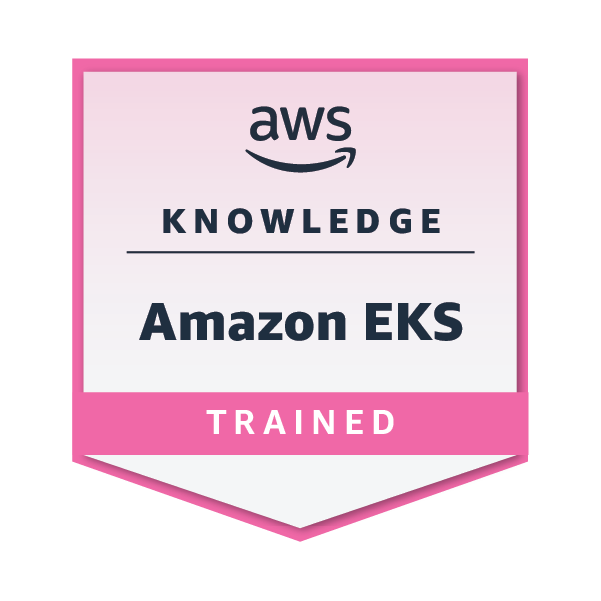
  </a>
  
  <a href="https://www.credly.com/badges/ac0c6698-6d8e-4793-bad2-08bdc25e9dbf" target="_blank" rel="noreferrer" style="margin-right: 10px;">
    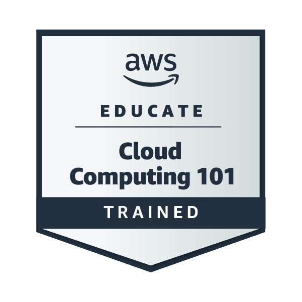
  </a>
  <a href="https://www.credly.com/badges/d98038fb-5bd6-41d0-b7ac-391c3f10d0af" target="_blank" rel="noreferrer" style="margin-right: 10px;">
    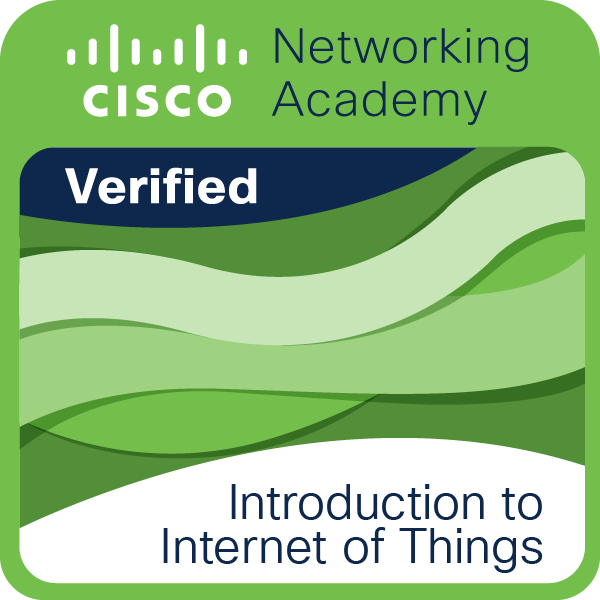
  </a>
  <a href="https://www.credly.com/badges/45d7b42f-e034-4f53-bde3-5755ff613c56" target="_blank" rel="noreferrer" style="margin-right: 10px;">
    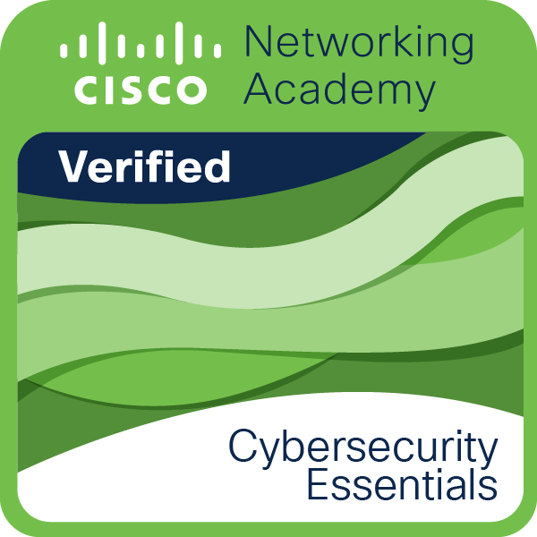
  </a>
  
  <a href="https://www.credly.com/badges/f9e9b2f2-94b7-45b9-86da-1de1d46cd2f9" target="_blank" rel="noreferrer" style="margin-right: 10px;">
    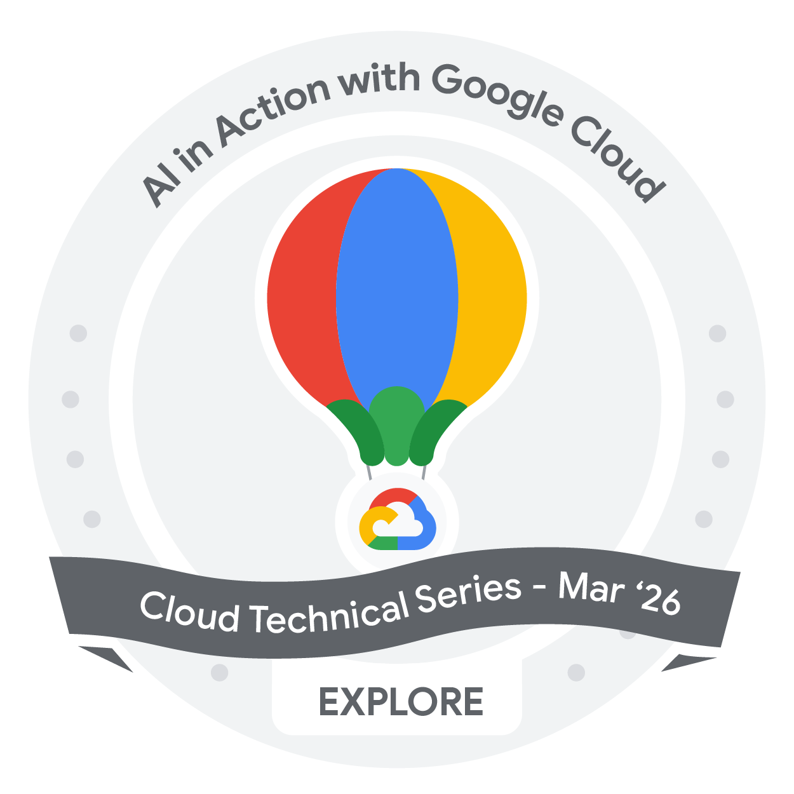
  </a>
  <a href="https://www.credly.com/badges/6e6054cc-b781-4a79-883c-d75e9421174d" target="_blank" rel="noreferrer" style="margin-right: 10px;">
    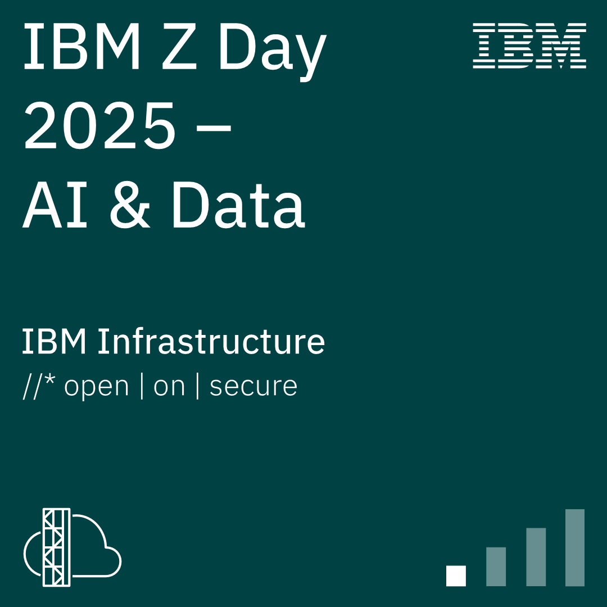
  </a>
  <a href="https://www.credly.com/badges/9829ab9b-eaac-4415-a7c0-282b50858a3c" target="_blank" rel="noreferrer" style="margin-right: 10px;">
    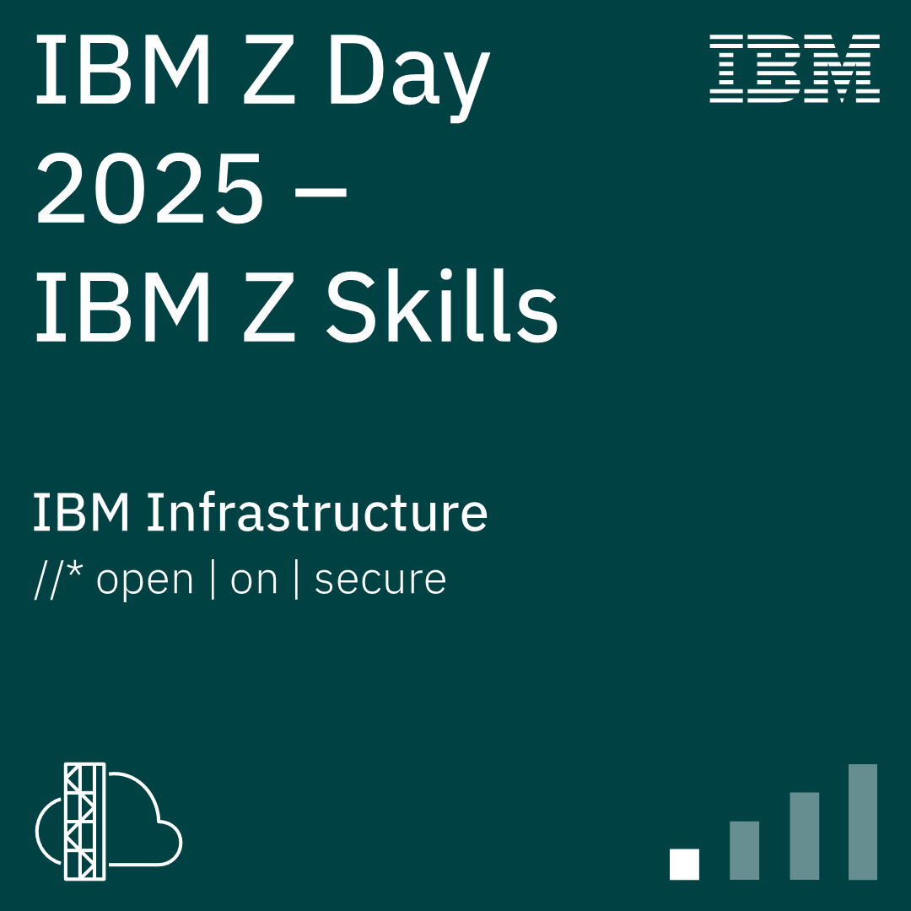
  </a>
  <a href="https://www.credly.com/badges/aeae6a00-8c8c-4cb2-a25c-b01d07bf4a25" target="_blank" rel="noreferrer" style="margin-right: 10px;">
    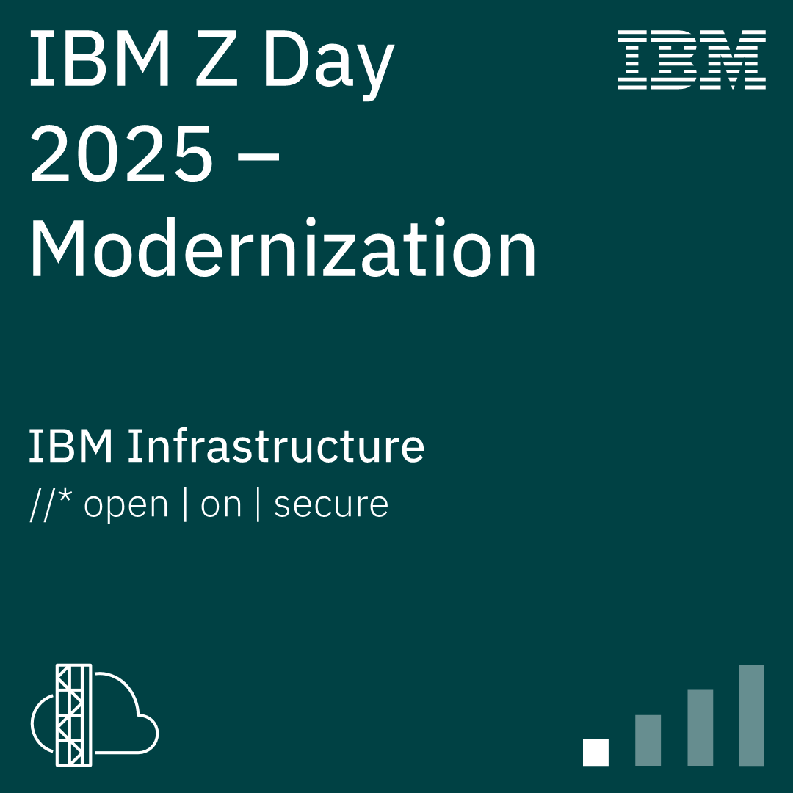
  </a>
  <a href="https://www.credly.com/badges/fbf17016-1272-4f7c-91fb-67f24fe895ce" target="_blank" rel="noreferrer" style="margin-right: 10px;">
    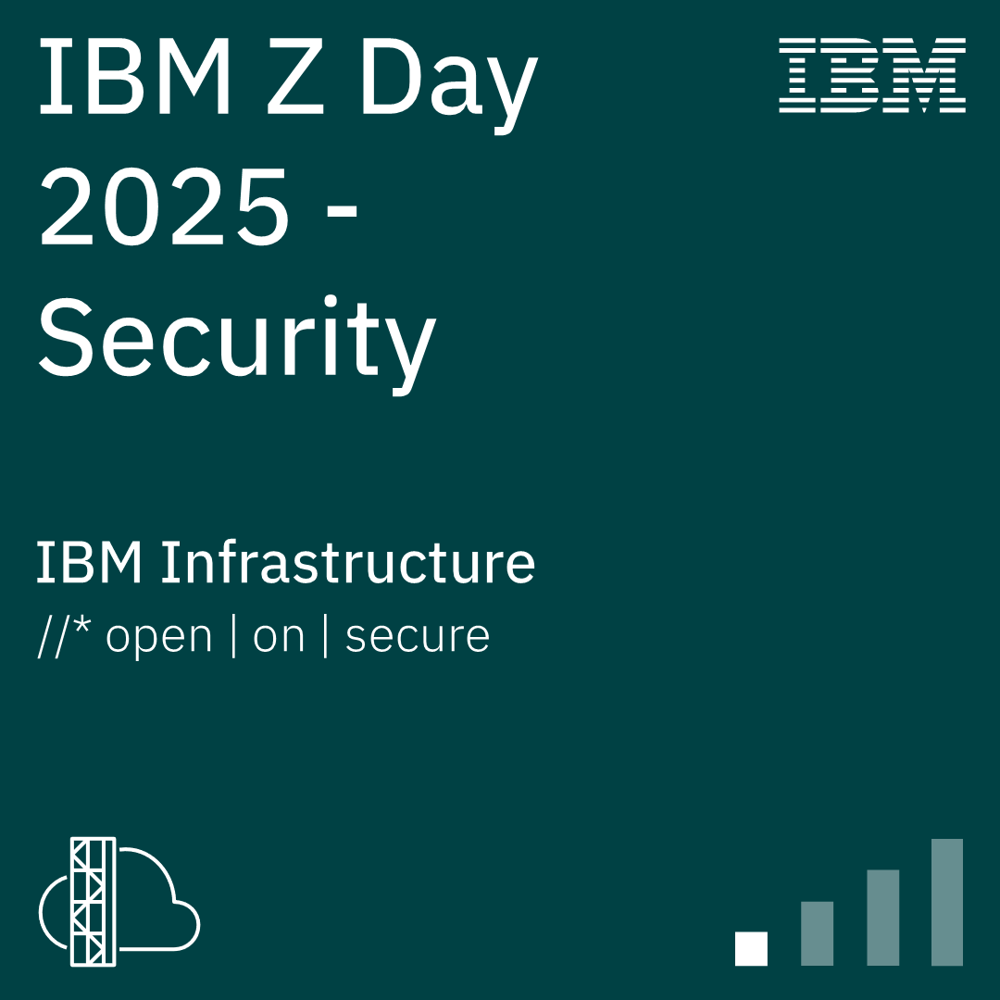
  </a>
  <a href="https://www.credly.com/badges/51d51c47-fdfb-42bf-ad79-f1b261c5b046" target="_blank" rel="noreferrer" style="margin-right: 10px;">
    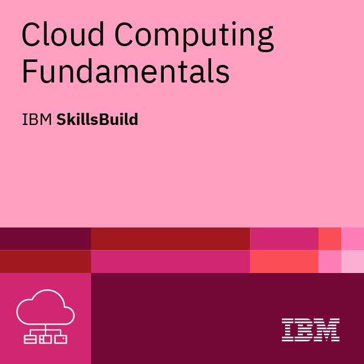
  </a>
  <a href="https://www.credly.com/badges/954b9418-2fbf-4632-b78b-f9669b6a1e85" target="_blank" rel="noreferrer" style="margin-right: 10px;">
    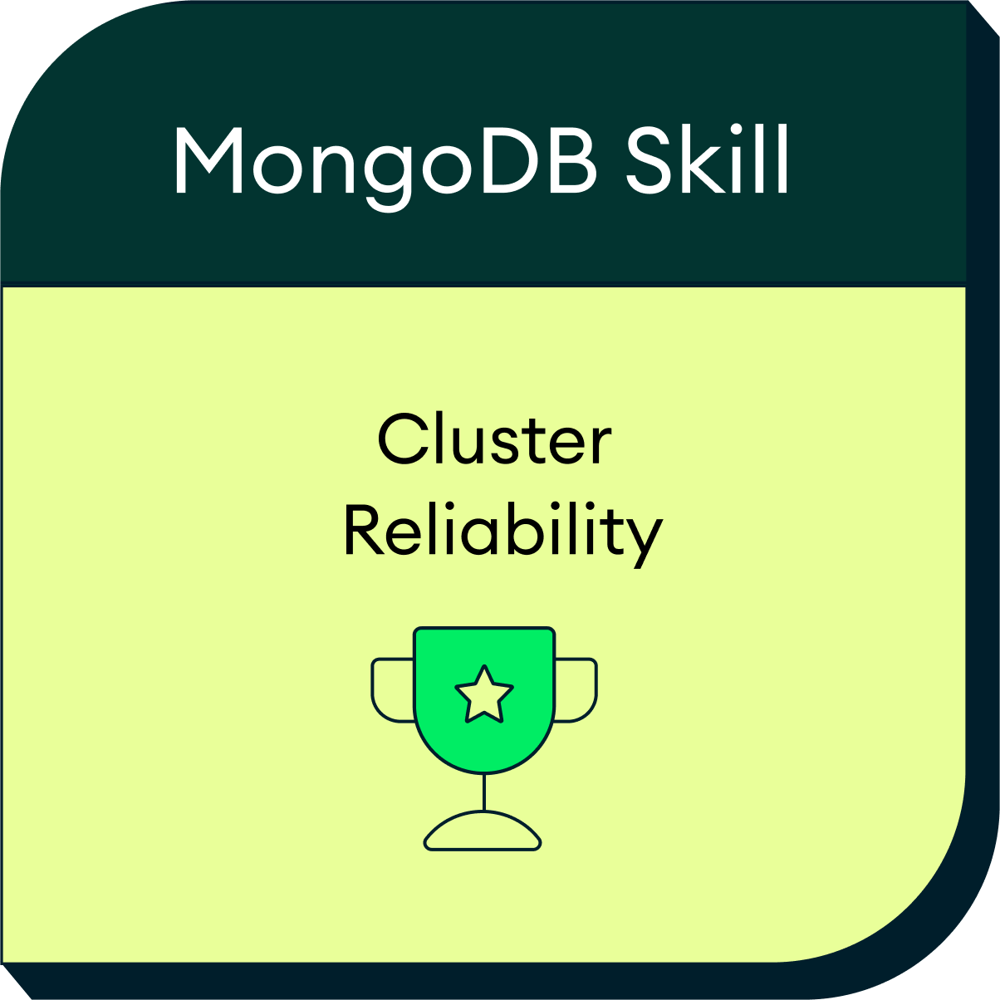
  </a>
  <a href="https://www.credly.com/badges/39d9dec4-822c-414a-b6da-1b0d90ddf1bc" target="_blank" rel="noreferrer" style="margin-right: 10px;">
    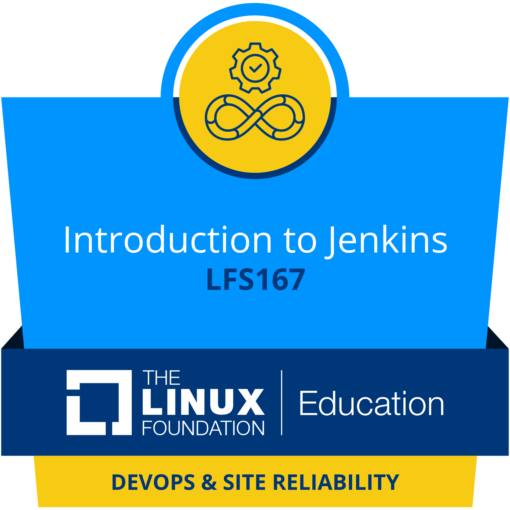
  </a>
  
  

### 👷 Check out what I'm currently working on

- [HimanM/jenkins-chained-cicd-infra-automation](https://github.com/HimanM/jenkins-chained-cicd-infra-automation) - This project is a comprehensive DevOps learning resource designed to demonstrate advanced CI/CD concepts, infrastructure automation, and containerization. It showcases a modern web application stack deployed through a robust, chained Jenkins pipeline architecture.
- [HimanM/aws-secure-two-tier-architecture](https://github.com/HimanM/aws-secure-two-tier-architecture) - A full-stack demonstration of a secure 2-tier architecture on AWS. Frontend in Public Subnet communicating with Backend in Private Subnet.
- [HimanM/devops-microservices-iac-pipeline](https://github.com/HimanM/devops-microservices-iac-pipeline) - A production-grade demonstration of modern DevOps practices, featuring containerized microservices, Infrastructure as Code (IaC), and automated CI/CD pipelines
- [HimanM/iac-config-mgmt-enterprise-demo](https://github.com/HimanM/iac-config-mgmt-enterprise-demo) - This project is an advanced demonstration of Infrastructure as Code (IaC) and Configuration Management principles, designed to simulate a real-world enterprise deployment.
- [HimanM/devsecops-aws-pipeline-githubactions](https://github.com/HimanM/devsecops-aws-pipeline-githubactions) - DevSecOps CI/CD pipeline using GitHub Actions with secret scanning, IaC security, policy-as-code enforcement, and manual approval gates, deploying containerized services to AWS via Terraform.
### 🌱 My latest projects

- [HimanM/Fuck-Udemy-Exam-UI](https://github.com/HimanM/Fuck-Udemy-Exam-UI) - A Tampermonkey userscript that fixes Udemy&#39;s absolutely fucking annoying practice exam interface.
- [HimanM/SAP02---Rate-Limiter](https://github.com/HimanM/SAP02---Rate-Limiter) - SYSTEM-ARCHITECTURE-PROJECT-02 RateGuard : A horizontally scalable API Gateway demonstrating distributed systems concepts. Implements Token Bucket rate limiting via Atomic Redis Lua scripts, fail-open resiliency, and NGINX Docker DNS resolution.
- [HimanM/SAP01---URL-Shortner](https://github.com/HimanM/SAP01---URL-Shortner) - SYSTEM-ARCHITECTURE-PROJECT-01 - Modular, containerized URL shortener demonstrating a decoupled system architecture (React frontend, Flask APIs, Redis cache, PostgreSQL primary/replica, Kafka streaming, and Docker Compose orchestration).
- [HimanM/Twitch-Predictions-Bot](https://github.com/HimanM/Twitch-Predictions-Bot) - Twitch Predictions Tampermonkey bot with underdog auto-bet strategy, live top-nav control panel, discovery probe detection, manual bet controls, and T-5s execution safety caps.
- [HimanM/Weather-Web-App-FullStack](https://github.com/HimanM/Weather-Web-App-FullStack) - Full-stack weather analytics dashboard with comfort index scoring - built with Next.js 16, Express 5, Redis, Auth0, and Docker. Fetches real-time data from OpenWeatherMap, ranks cities by a weighted geometric mean comfort algorithm, and presents insights through a responsive dark/light themed UI.
### 🔨 My recent Pull Requests

- [Feat/early bet timer &#43; 0 point bet bug fix](https://github.com/HimanM/Twitch-Predictions-Bot/pull/8) on [HimanM/Twitch-Predictions-Bot](https://github.com/HimanM/Twitch-Predictions-Bot)
- [Feat/improve UI](https://github.com/HimanM/Twitch-Predictions-Bot/pull/7) on [HimanM/Twitch-Predictions-Bot](https://github.com/HimanM/Twitch-Predictions-Bot)
- [Feat/UI improvements](https://github.com/HimanM/Twitch-Predictions-Bot/pull/6) on [HimanM/Twitch-Predictions-Bot](https://github.com/HimanM/Twitch-Predictions-Bot)
- [Fix/fix race conditions](https://github.com/HimanM/Twitch-Predictions-Bot/pull/5) on [HimanM/Twitch-Predictions-Bot](https://github.com/HimanM/Twitch-Predictions-Bot)
- [Feat/modularize](https://github.com/HimanM/Twitch-Predictions-Bot/pull/4) on [HimanM/Twitch-Predictions-Bot](https://github.com/HimanM/Twitch-Predictions-Bot)
### ⭐ Recent Stars

- [siddharthvaddem/openscreen](https://github.com/siddharthvaddem/openscreen) - Create stunning demos for free. Open-source, no subscriptions, no watermarks, and free for commercial use. An alternative to Screen Studio. 
- [M3rcena/Udeler_GUI](https://github.com/M3rcena/Udeler_GUI) - A desktop application for downloading Udemy Courses
- [stowmyy/dropship](https://github.com/stowmyy/dropship) - a portable server selector for Overwatch 2
- [nongpolymath/prom-grafana-stack](https://github.com/nongpolymath/prom-grafana-stack) - Prometheus &#43; Grafana Monitoring stack for local observability with metrics collection, dashboards, alerting and app instrumentation
- [localstack/localstack](https://github.com/localstack/localstack) - 💻 A fully functional local AWS cloud stack. Develop and test your cloud &amp; Serverless apps offline
