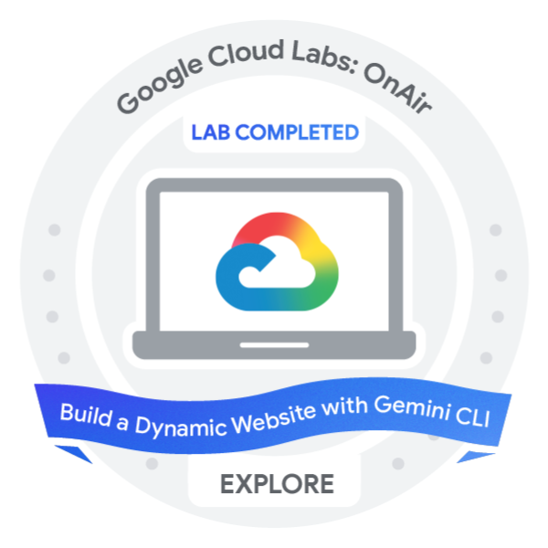
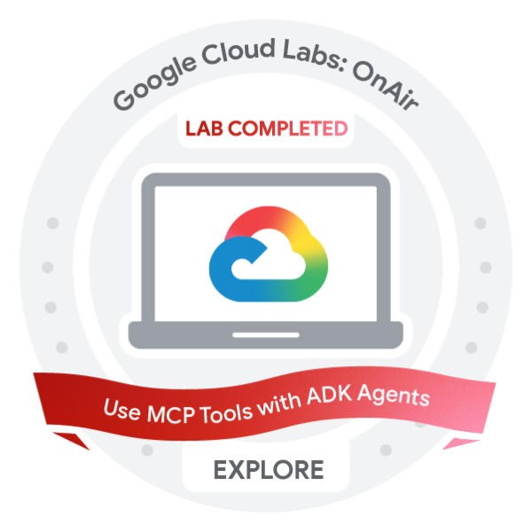
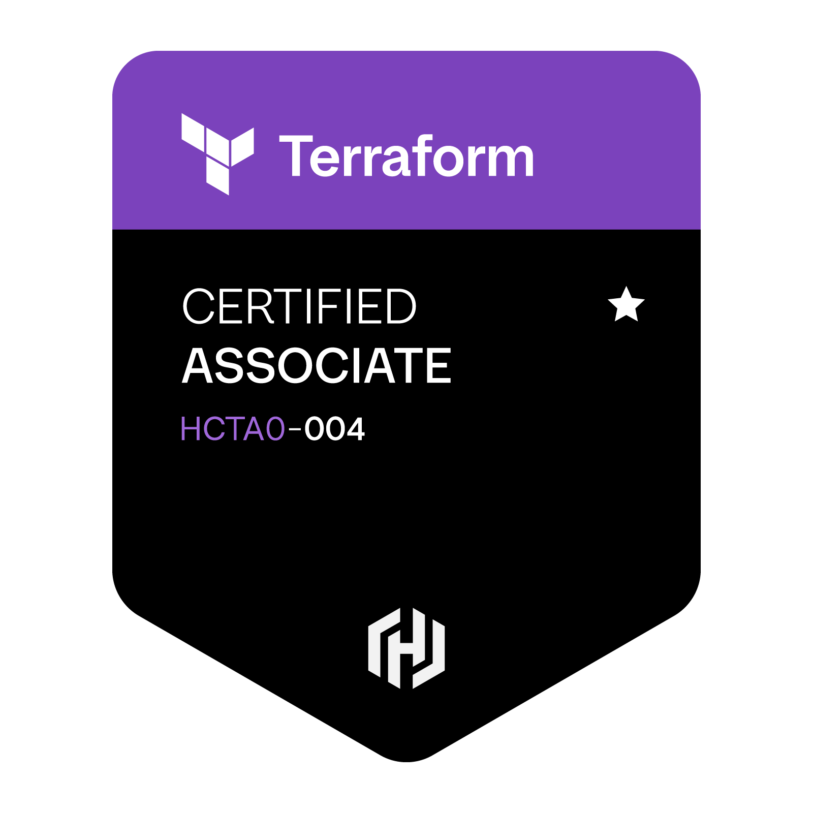

### Socials

 
<a href="https://www.github.com/HimanM" target="_blank" rel="noreferrer"> 
  <picture> <source media="(prefers-color-scheme: dark)" srcset="https://raw.githubusercontent.com/danielcranney/readme-generator/main/public/icons/socials/github-dark.svg" /> 
    <source media="(prefers-color-scheme: light)" srcset="https://raw.githubusercontent.com/danielcranney/readme-generator/main/public/icons/socials/github.svg" /> 
       
  </picture> 
</a> 
<a href="http://www.instagram.com/himanmanduja" target="_blank" rel="noreferrer"> 
  <picture> <source media="(prefers-color-scheme: dark)" srcset="https://raw.githubusercontent.com/danielcranney/readme-generator/main/public/icons/socials/instagram-dark.svg" /> 
    <source media="(prefers-color-scheme: light)" srcset="https://raw.githubusercontent.com/danielcranney/readme-generator/main/public/icons/socials/instagram.svg" /> 
       
  </picture> 
</a> 
<a href="https://www.linkedin.com/in/himanm" target="_blank" rel="noreferrer"> 
  <picture> <source media="(prefers-color-scheme: dark)" srcset="https://raw.githubusercontent.com/danielcranney/readme-generator/main/public/icons/socials/linkedin-dark.svg" /> 
    <source media="(prefers-color-scheme: light)" srcset="https://raw.githubusercontent.com/danielcranney/readme-generator/main/public/icons/socials/linkedin.svg" /> 
       
  </picture> 
</a>

### 🏅 Certifications

  
  
  
  
  
  
  
  
  
  
  
  
  
  
  
  
  
  
  
  

### 👷 Check out what I'm currently working on

- [HimanM/BrokenOps](https://github.com/HimanM/BrokenOps) - An interactive, open-source DevOps and Sysadmin training platform that spins up intentionally broken VMs for hands-on troubleshooting practice. Features in-browser terminal, automated verification, and gamified progress tracking.
- [HimanM/Github-Actions-Telemetry](https://github.com/HimanM/Github-Actions-Telemetry) - A Centralized GitHub Actions Telemetry Observer that securely monitors workflow execution, extracts structured metrics (JSON), and generates visual timeline reports (SVG) for any repository, without modifying the target workflows.
- [HimanM/medusa-tattoo-studio](https://github.com/HimanM/medusa-tattoo-studio) - Tattoo Studio Medusa - A premium gothic tattoo studio landing page. Vibe coded with Google Gemini.
- [HimanM/Predicting-Optimal-Fertilizers](https://github.com/HimanM/Predicting-Optimal-Fertilizers) - FertiliZen is a personal project built on top of a model developed for the Kaggle Fertilizer Prediction Challenge   Note: FertiliZen provides fertilizer suggestions based on a predictive model trained on a synthetic dataset. Always consult local agricultural experts for critical decisions.
- [HimanM/iac-config-mgmt-enterprise-demo](https://github.com/HimanM/iac-config-mgmt-enterprise-demo) - This project is an advanced demonstration of Infrastructure as Code (IaC) and Configuration Management principles, designed to simulate a real-world enterprise deployment.
### 🌱 My latest projects

- [HimanM/BrokenOps](https://github.com/HimanM/BrokenOps) - An interactive, open-source DevOps and Sysadmin training platform that spins up intentionally broken VMs for hands-on troubleshooting practice. Features in-browser terminal, automated verification, and gamified progress tracking.
- [HimanM/Github-Actions-Telemetry](https://github.com/HimanM/Github-Actions-Telemetry) - A Centralized GitHub Actions Telemetry Observer that securely monitors workflow execution, extracts structured metrics (JSON), and generates visual timeline reports (SVG) for any repository, without modifying the target workflows.
- [HimanM/medusa-tattoo-studio](https://github.com/HimanM/medusa-tattoo-studio) - Tattoo Studio Medusa - A premium gothic tattoo studio landing page. Vibe coded with Google Gemini.
- [HimanM/OpneClaw-k8s-with-Knative](https://github.com/HimanM/OpneClaw-k8s-with-Knative) - Run OpenClaw AI agent runtime serverlessly on Kubernetes - scales to zero when idle, wakes on demand in under 60 seconds, persists state across cycles. One-command local setup with Knative &#43; Kourier.
- [HimanM/aurasmile-landing-page](https://github.com/HimanM/aurasmile-landing-page) - A cinematic, Dribbble‑inspired &#34;vibe‑coded&#34; studio UI prototype. Built with React (v19), Vite, Tailwind CSS v4, Framer Motion &amp; GSAP, and TypeScript; visual designs were assisted by Google Gemini / Google AI Studio. 
### 🔨 My recent Pull Requests

- [Simplify fork README](https://github.com/HimanM/TwitchDropsMiner/pull/3) on [HimanM/TwitchDropsMiner](https://github.com/HimanM/TwitchDropsMiner)
- [[codex] add Textual tdminer TUI](https://github.com/HimanM/TwitchDropsMiner/pull/2) on [HimanM/TwitchDropsMiner](https://github.com/HimanM/TwitchDropsMiner)
- [[codex] port original cache and Polish updates](https://github.com/HimanM/TwitchDropsMiner/pull/1) on [HimanM/TwitchDropsMiner](https://github.com/HimanM/TwitchDropsMiner)
- [feat: add package-repo-broken troubleshooting lab](https://github.com/HimanM/BrokenOps/pull/174) on [HimanM/BrokenOps](https://github.com/HimanM/BrokenOps)
- [feat: add firewall-rule-order troubleshooting lab](https://github.com/HimanM/BrokenOps/pull/173) on [HimanM/BrokenOps](https://github.com/HimanM/BrokenOps)
### ⭐ Recent Stars

- [DietrichGebert/ponytail](https://github.com/DietrichGebert/ponytail) - Makes your AI agent think like the laziest senior dev in the room. The best code is the code you never wrote.
- [mudrii/hermesd](https://github.com/mudrii/hermesd) - TUI monitoring dashboard for Hermes AI agent
- [fathah/hermes-desktop](https://github.com/fathah/hermes-desktop) - Desktop Companion for Hermes Agent
- [garrytan/gbrain](https://github.com/garrytan/gbrain) - Garry&#39;s Opinionated OpenClaw/Hermes Agent Brain
- [pewdiepie-archdaemon/odysseus](https://github.com/pewdiepie-archdaemon/odysseus) - Self-hosted AI workspace. 
